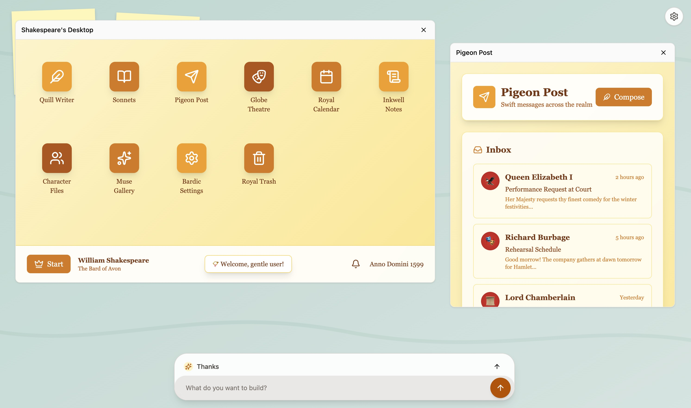

<div align="center">
  <h1 style="margin-bottom: 0;">Generative UI</h1>
  <span>Open Source "Imagine with Claude"</span>
</div>

<br/>

<div align="center">
  <a href="https://youtube.com/shorts/65uOIydXrQs">Demo Reel</a> | <a href="https://youtube.com/shorts/bYmYJf6lBhE">Pitch Reel</a>
</div>

Ask AI to build an app. It creates a window on the canvas for you and also adds logic to invoke itself on user interactions. When you interact with the window like say clicking a button, the agent will be invoked and will edit the window to reflect appropriate changes. The agent is also able to create new windows or edit existing windows accordingly.




## Table of Contents
* [Architecture](#architecture)
* [Agent and tools](#agent-and-tools)
* [Local setup](#local-setup)
* [Key files](#key-files)


### Architecture
- React Flow canvas to render the windows
- Iframes to render each window/app created by the agent
- LLM calls made from the browser with no backend server needed and BYOK
- Tools for the agent to create or edit window contents
- Streaming everywhere

**Triggers**

- User query triggers the agent and the agent can either create a new window or edit the current one
- Window interactions post `window-event` messages to the host. The host re-invokes the agent to continue the flow.


### Agent and tools
The agent operates with minimal text output and primarily uses tools to create or edit windows:

- **Window events**: The agent is instructed to write logic to trigger iframe messages based on user interactions such as clicks, form submissions, etc. These messages are used to re-invoke the agent to continue the flow.
- **create_new_window(name, html)**: Add a new iframe window with full HTML (uses `srcdoc`). Provisional window appears as arguments stream.
- **dom_replace(windowId, mutations[])**: Apply selector‑scoped DOM mutations to existing windows (set/replace/insert/remove, attrs/classes). Preferred for small, precise changes.
- **update_window_title(windowId, title)**: Rename a window after major changes.
- **set_window_html(windowId, html)**: Replace the entire window HTML when a large rewrite is needed.


### Model‑agnostic, browser‑only calls
Based on [Simon Willison's Blog](https://simonwillison.net/2024/Aug/23/anthropic-dangerous-direct-browser-access/)
- Works with multiple providers (OpenAI, Anthropic; Gemini supported in code) using the OpenAI SDK from the browser.
- Anthropic is enabled via a custom `baseURL` and the `anthropic-dangerous-direct-browser-access` header.
- Your API key and selected model/provider are stored only in `localStorage` on your machine.
- Ensure your provider allows direct browser usage and CORS for your domain.


### Local setup
1) Install and run
```bash
cd frontend
npm install
npm run dev
```
Open http://localhost:5173.

Optional build/preview:
```bash
npm run build
npm run preview
```

2) Configure a provider
- Click the settings button (top‑right) or submit a prompt to open the dialog.
- Choose a provider and model; paste your API key.
- Keys and selections are saved to `localStorage` in this browser.


### Key files
- `src/App.tsx`: Canvas, node lifecycle, streaming handlers, postMessage listener.
- `src/lib/ai.ts`: System prompt, tool schemas, multi‑step streaming bridge (text + tool calls + usage).
- `src/components/IframeNode.tsx`: Iframe window node UI (resizing, sandboxed `srcdoc`).
- `src/components/ApiKeyDialog.tsx`: Provider/model selection and key storage.


